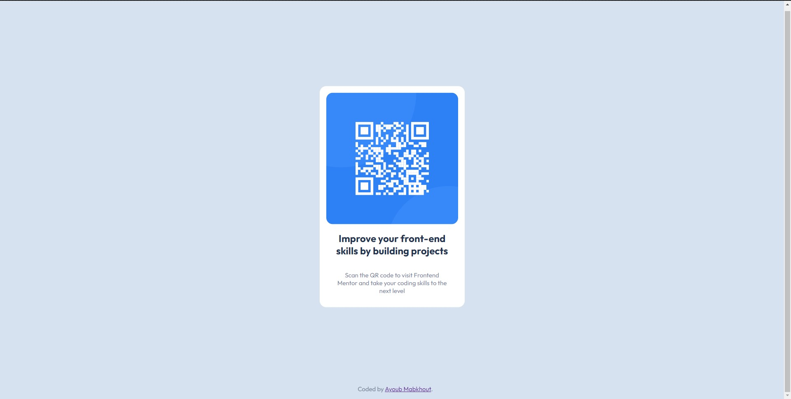

# Frontend Mentor - QR code component solution

This is a solution to the [QR code component challenge on Frontend Mentor](https://www.frontendmentor.io/challenges/qr-code-component-iux_sIO_H). Frontend Mentor challenges help you improve your coding skills by building realistic projects. 

## Overview

### Screenshot

### Links

- Solution URL: [Repository](https://github.com/Ayoub-Mabkhout/QR-code-component.git)
- Hosted Web Page URL: [Replit](https://qr-code-component.ayoub-mabkhout.repl.co/)

## My process

### Built with

- Semantic HTML5 markup
- CSS custom properties
- Flexbox
- SASS
- Parcel

### How to compile
1. Clone the repository on your hard drive.
2. Cd to the directory and run the command "npm install".
3. Run the command "npx parcel 'src/index.html'".
4. The development server runs on next port 1234.

### What I learned

Nothing. Just got to submit my first Frontend Mentor challenge solution.

## Author

- Github - [Ayoub Mabkhout](https://github.com/Ayoub-Mabkhout)
- Frontend Mentor - [@Ayoub-Mabkhout](https://www.frontendmentor.io/profile/Ayoub-Mabkhout)
